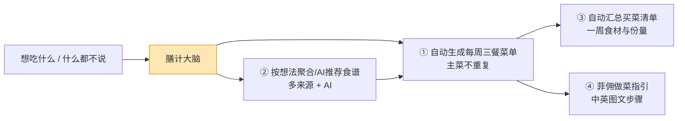
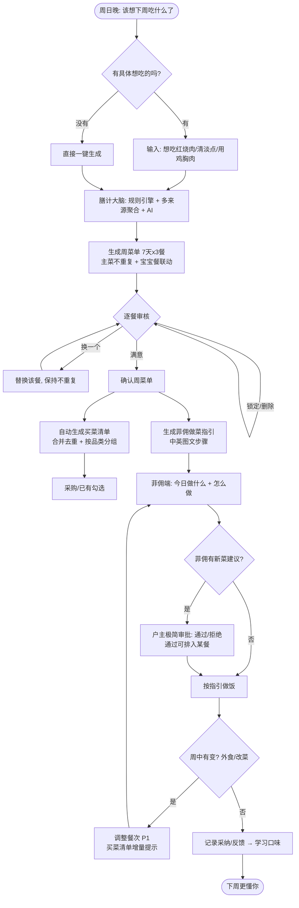
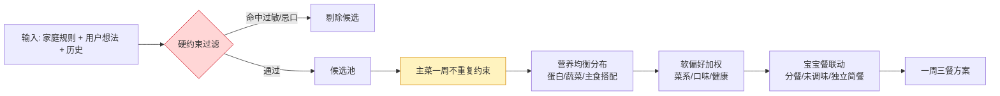
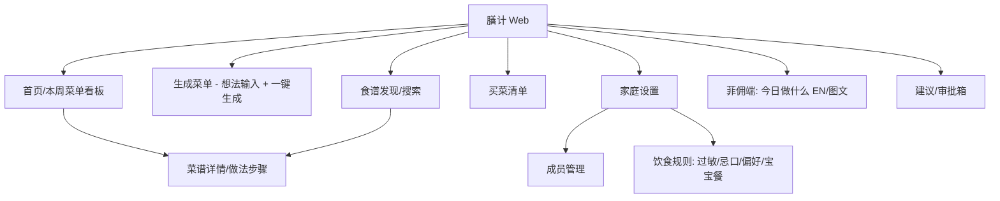
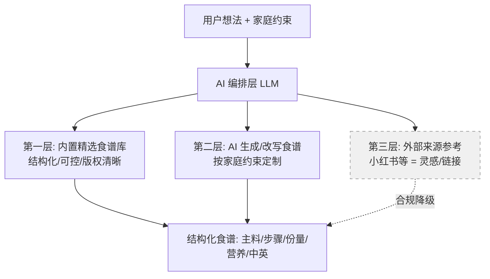
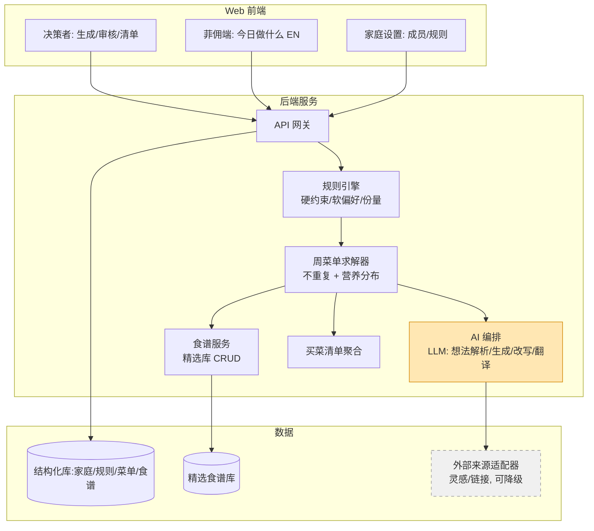

# 膳计 ShanJi —— 家庭膳食规划助手 PRD

> 一句话定义：**一个替你做"这周吃什么"决策的家庭膳食大脑**。你只需说出想吃的，或什么都不说，它就能按全家人的饮食需求生成一周不重复的三餐菜单、买菜清单，以及菲佣看得懂的做菜指引。

---

## 0. 文档信息

| 项 | 内容 |
|---|---|
| 产品名（暂定） | 膳计 ShanJi |
| 文档版本 | v0.2（评审修订版） |
| 作者 | 产品（与用户共创） |
| 日期 | 2026-06-09（v0.1：2026-06-07） |
| 状态 | 已评审修订 → 待开发 |
| 形态 | Web 应用（移动端浏览器优先，桌面端可用） |
| 目标 | 作为后续开发的需求基线 |

**v0.2 修订要点**（来自 Fable 5 评审）：
1. 北极星指标改为行为指标（"菲佣不再问吃什么"），"换一个"操作定义为学习信号而非失败。
2. 新增**餐次构成模板**（午/晚 = 1 荤 + 1 素 + 可选汤）——原文按"一餐一道菜"叙述与中餐现实不符。
3. 新增**复用餐**概念（一锅两顿，不算重复违例）。
4. 菲佣建议入口（P0）配套**极简审批**进 MVP，消除"建议进黑洞"的矛盾。
5. 买菜清单**中英双语**（采购执行者是菲佣）；新增单位归一化要求。
6. 做菜指引**双语文字优先，图片可选**，降低食谱库冷启动成本。
7. 明确账号与访问模型：家庭账号 + 菲佣免登录链接。
8. 宝宝分餐增加 `baby_split_point` 数据结构支撑。
9. 新增周中调整 + 买菜清单增量（P1）。
10. 技术选型拍板：~~Next.js 全栈~~ →（v0.2.3）**Go 后端 + Next.js 前端**；生成性能由"分天流式"升级为"库内即时填满整周 <1s"（v0.2.2 工程评审 E2）。
11. （v0.2.1 增补）**菜系偏好驱动选菜**：新增家庭主菜系设置（如粤菜），候选排序、AI 生成基调、周菜单配比（主菜系默认 ≥ 60%）、食谱库组库配比均以主菜系为第一软偏好；RECIPE 增加 `cuisine` 字段。

---

## 1. 背景与问题

### 1.1 真实痛点（来自用户自述）
- 每天要为全家想 **早/午/晚三餐**，且希望**尽量不重复**，决策疲劳严重。
- 家里有菲佣做饭，但**"吃什么"的决策权和心智负担仍在用户身上**——菲佣常来问"今天吃什么"，需要用户拍板。
- 菲佣偶尔会提新菜式/新做法，但**仍需用户确认**才落地。
- 用户本身喜欢做饭，但"每天想吃什么、做什么"依然是高频且令人疲惫的事。
- 现状靠刷小红书找食谱，**信息分散、需要人工筛选、没有按全家需求做个性化**。

### 1.2 问题本质
> 痛点不是"找不到食谱"，而是**"每天/每周反复做膳食决策"的认知负担**。
> 食谱供给是充足的（小红书海量），稀缺的是**"按我家约束自动编排好、可直接执行的方案"**。

### 1.3 机会
做一个**决策代理（Decision Agent）**，把"想吃什么 → 一周菜单 → 买菜清单 → 做菜指引"这条链路自动化，把用户从"决策者"降负为"审核者"。

---

## 2. 目标用户与画像（Personas）

| 角色 | 画像 | 在产品中的身份 | 核心诉求 |
|---|---|---|---|
| **决策者（主用户）** | 37 岁男，喜欢做饭，时间紧、决策累 | 管理员 / 决策者 | 一键生成方案、快速审核、随口表达"想吃什么"即可 |
| **配偶** | 33 岁女 | 家庭成员（口味偏好录入） | 自己的口味/忌口被尊重，可以否决或点菜 |
| **女儿** | 2 岁幼儿 | 家庭成员（特殊膳食对象） | 少盐少油、软烂、营养均衡、与大人餐协同 |
| **菲佣（执行者）** | 家庭帮佣，母语非中文（英文/他加禄语） | 厨房执行者 | **看得懂当天做什么、怎么做**（需英文/图文）；能提交新菜建议 |

> 关键设计含义：
> 1. **多角色**：决策者（审核/拍板）+ 执行者（菲佣，看 + 建议）。
> 2. **多语言**：菲佣端需英文界面 / 中英对照做法。
> 3. **多餐别对象**：宝宝餐需要独立的规则与产出。

---

## 3. 产品目标与成功指标

### 3.1 北极星指标
**"每周持续生成并确认菜单，且菲佣'今天吃什么'的提问次数趋近于零"**
（这是痛点的直接度量：决策负担真的从用户身上移走了。注意：这是单一家庭使用的产品，行为指标比比例指标更有意义。）

### 3.2 关键指标（MVP 阶段）
| 维度 | 指标 | 目标 |
|---|---|---|
| 价值兑现 | 菲佣"今天吃什么"提问次数 | 趋近 0 次/周 |
| 效率 | 单周规划耗时 | 从"每天反复想"降到 **< 5 分钟/周** |
| 留存 | 每周至少生成并确认一次菜单 | 连续保持，不回退到刷小红书 |
| 学习信号 | "换一个"操作率 | 随使用时间下降（**早期偏高是正常的**——换菜是最有价值的口味学习素材，不是失败） |
| 多样性 | 一周内主菜重复率 | ≈ 0（主菜不重复为硬约束；标记为"复用餐"的除外，见 §6.3） |

---

## 4. 核心价值主张（四大支柱，均为用户确认的 P0）



1. **自动生成每周菜单**：一键产出周一~周日 × 早/午/晚的菜单，主菜不重复，符合全家约束。
2. **按想法抓取/推荐食谱**：用户用自然语言说"想吃红烧肉""这周清淡点""用现有的鸡胸肉做点新花样"，系统从**多来源聚合 + AI** 给出可执行食谱。
3. **自动生成买菜清单**：从整周菜单反推食材与份量，合并去重，按品类分组，方便采购。
4. **菲佣做菜指引**：把选定菜谱整理成菲佣看得懂的**中英对照步骤**（文字为主、图片可选），减少沟通。

---

## 5. 用户故事（User Stories）

**决策者**
- 作为决策者，我希望**一键生成下周菜单**，这样我不必每天想吃什么。
- 作为决策者，我希望**随口说"想吃川菜"就能得到几道候选**，并加入到某天某餐。
- 作为决策者，我希望对生成的菜单**逐餐快速"换一个/锁定/删除"**，3 分钟内审核完。
- 作为决策者，我希望系统**自动避开过敏/忌口食材**，不用每次提醒。

**配偶 / 家庭成员**
- 作为家庭成员，我希望**录入我的口味偏好和忌口**，让推荐尊重我。
- 作为家庭成员，我希望能给某一餐**点菜或否决**。

**宝宝（由家长代理）**
- 作为家长，我希望系统为 2 岁宝宝**自动安排少盐少油、软烂、营养均衡的餐**，最好能**从大人菜的"未调味前"版本分一份**。

**菲佣（执行者）**
- 作为菲佣，我希望**打开 App 就能看到今天做什么、几点做、怎么做（英文/图文）**。
- 作为菲佣，我希望能**提交一个我会做的新菜建议**，等户主确认后排进菜单。

---

## 6. 功能需求（按优先级）

> 优先级：**P0 = MVP 必须**；**P1 = 第二迭代**；**P2 = 远期**。

### 6.1 家庭档案与饮食规则引擎（P0）—— 产品的"大脑根基"
- **家庭成员管理**：成员列表（含年龄、角色），用于份量与营养计算。
- **饮食规则（硬约束 / 软偏好）**：
  - 硬约束（必须满足）：过敏源、绝对忌口、宝宝餐规则（少盐/少油/软烂/分龄营养）。
  - 软偏好（尽量满足）：**菜系偏好**（粤/川/湘…）、口味（辣度/咸淡）、健康导向（高蛋白、控油盐糖、多蔬菜）。
- **家庭主菜系（household cuisine profile）**：家庭设置中指定 1 个主菜系 + 可选次菜系（如：主粤菜、次江浙）。主菜系是选菜加权的第一软偏好——周菜单中主菜系占比应明显占优（默认 ≥ 60%，可调），其余名额留给次菜系与"尝鲜"推荐，保证既合口味又有新鲜感。
- **规则优先级**：硬约束 > 不重复约束 > 软偏好 > 多样性。
- **份量模型**：按成员数与年龄估算每餐份量（3 个大人 + 宝宝小份）。
- **账号与访问（P0）**：一个**家庭账号**（户主登录，拥有全部权限）；**菲佣端走免登录分享链接**（magic link，仅能访问"今日做什么"视图与建议入口）；配偶可共用家庭账号或后续单独邀请（P1）。MVP 不做完整多用户体系。

### 6.2 想法输入与食谱发现（P0）
- **自然语言入口**："想吃红烧肉""清淡点""用鸡胸肉""换个新做法"。
- **食谱来源：多来源聚合 + AI**（详见 §9 来源策略）：
  - 内置精选食谱库（结构化、可控）。
  - AI 生成/改写食谱（按家庭约束定制，补足库里没有的）。
  - 外部来源（小红书等）作为**灵感/参考**，带合规降级方案。
- **候选卡片**：每道菜给出名称、**菜系标签**、图、预计耗时、难度、主料、是否命中约束、营养概要。
- **候选排序按菜系偏好加权**：默认优先展示家庭主菜系（如粤菜）的做法——同一道"想吃的菜"优先给主菜系版本（如"清蒸鲈鱼"优先于"水煮鱼"）；自然语言中明确指定菜系时（"想吃川菜"），临时覆盖默认偏好。AI 生成/改写也以主菜系风格为默认基调。

### 6.3 每周菜单自动生成（P0）—— 核心杀手锏
- **餐次构成（默认模板，核心规格）**：中餐一餐不是一道菜。默认模板：
  - **午餐/晚餐 = 1 荤（主菜，受一周不重复硬约束）+ 1 素 + 可选汤**；素菜与汤允许在一周内低频重复。
  - **早餐 = 单品**（在小集合内轮换，允许重复）。
  - 模板可在家庭设置中调整（如晚餐升级为 2 荤 1 素 1 汤）。求解器、份量估算、买菜清单都以此模板为基础。
- **一键生成**周计划（7 天 × 早/午/晚，按餐次构成模板填充）。
- **约束求解**：满足硬约束 + **主菜一周不重复** + 软偏好加权（**菜系偏好为第一权重**：主菜系占比默认 ≥ 60%，见 §6.1）+ 营养均衡分布（MVP 为标签级均衡：荤/素/主食搭配，不做卡路里计算）。
- **逐餐操作**：换一个、锁定（重排时不动）、删除、手动指定。
- **复用餐（一锅两顿）**：可将某道菜标记为"做双份"，次日自动排入指定餐次且**不算重复违例**。贴近真实做饭习惯，减少菲佣工作量与食材浪费。
- **宝宝餐联动**：每餐自动生成宝宝版本（优先"从大人菜分餐 + 未调味"——依赖菜谱步骤中的**分餐点标记**（`baby_split_point`，见 §10），明确在哪一步之前分出宝宝份；无分餐点的菜则生成独立简餐）。
- **重排**：保留已锁定餐次，重排其余。
- **生成性能**：分天**流式生成**，先出前 2 天（< 10s），其余后台补全（见 §12）。

### 6.4 买菜清单（P0）
- 从整周菜单**反推食材 → 单位归一化 → 合并同类 → 估算总份量 → 按品类分组**（肉/菜/调料/主食…）。
- **中英双语**：采购执行者很可能是菲佣，食材名与份量必须中英对照，否则闭环在采购环节断掉。
- **单位归一化**：维护单位词典（克/斤/个/根/勺/适量…），同一食材跨菜谱合并前先归一到可采购单位；无法归一的（"适量"）单独列出不参与合并。这是清单可用性的工程前提。
- 支持**勾选已有/已购**，导出/分享（文本或图片，便于发采购或带去市场）。

### 6.5 菲佣执行端（P0）
- **访问方式**：免登录分享链接（见 §6.1），打开即是"今日做什么"。
- **今日视图**：今天三餐做什么、建议时间、每道菜的步骤。
- **多语言**：界面英文，做法**中英对照**；**双语文字为主，步骤图片可选**——精选库配图有版权与工作量问题，AI 生成食谱无图，MVP 不把图片作为必需项（见 R4）。
- **菲佣建议入口**：菲佣可提交"新菜/新做法"，进入待户主确认队列；**配套极简审批**（见 §6.6 P0 部分），保证建议有去处。

### 6.6 审核与协作
**P0（进 MVP 的极简版）**
- **极简审批**：户主侧一个"建议箱"列表，对菲佣建议做**通过 / 拒绝**两键操作；通过后可一键排入某天某餐。不做评论、修改、流转等复杂流程。

**P1**
- 完整审批（同意→入库/排期，拒绝→附理由反馈）。
- 家庭成员点菜/否决，决策者统一拍板。
- **周中调整**：已确认菜单支持临时改菜、标记外食（跳过该餐）；调整后**买菜清单给出增量提示**（新增需买 / 已买多余）。现实中菜单一定会变，闭环不能是只进不退的直线。
- 通知/提醒（周日提醒生成下周菜单；当天提醒菲佣）。

### 6.7 学习与个性化（P1/P2）
- 记录"采纳/换掉/家人反馈"，**学习全家口味**，让推荐越来越准。
- 季节/库存感知（应季食材、冰箱现有食材优先消耗）。
- 历史菜单回看、"再来一次上周那套"。

### 6.8 远期（P2）
- **iOS App**（消费同一套 /api/v1，原生 UI + APNs 推送提醒；架构已为此预留，见 §12 多客户端可移植）。
- 营养报表（周/月营养结构）。
- 接入生鲜电商一键下单。
- 语音输入、家庭多人实时协作。

---

## 7. 关键用户流程

### 7.1 主流程：从"想吃什么"到"菲佣开做"（端到端）



### 7.2 周菜单生成的约束求解逻辑



---

## 8. 信息架构（页面结构）



> 角色可见性：决策者看到全部；菲佣端默认进入 **MaidView（今日做什么）** + 建议入口；家庭成员可访问偏好录入与点菜。

---

## 9. 食谱来源策略（多来源聚合 + AI）—— 关键技术与合规决策

> 你选择了"多来源聚合 + AI"。这是体验最好的方案，但**外部抓取（尤其小红书）存在反爬与版权/合规风险**。产品必须按"分层 + 降级"设计，不把可用性绑死在抓取上。

### 9.1 三层来源


- **第一层 内置精选库（推荐主力）**：自建结构化中餐食谱库，字段统一（主料、辅料、步骤、份量、营养标签、难度、耗时、中英文）。可控、稳定、合规。
- **第二层 AI 生成/改写**：用大模型按家庭约束**生成或改写**食谱（如"把这道菜做成宝宝版""用鸡胸肉换个做法"）。无版权问题，灵活。**风险：做法可信度**——需经库内模板/规则校验，避免"AI 乱编步骤"。
- **第三层 外部来源（小红书等）= 仅灵感/引流**：作为**参考链接/灵感来源**呈现，而非直接搬运正文。**不做大规模抓取存储**，规避反爬与版权。若做，仅在用户主动粘贴链接/搜索时，做轻量解析并标注出处。

### 9.2 合规与降级原则
- **可用性不依赖抓取**：抓取层不可用时，库 + AI 仍能完整出菜单。
- **尊重版权**：外部内容标注来源、给原文链接，不整段复制存储。
- **未决问题**（见 §13）：小红书抓取的具体边界需进一步确认，建议 MVP **先不做小红书抓取**，用"库 + AI"跑通核心闭环。

---

## 10. 数据模型（概念 ER）

```mermaid
erDiagram
    HOUSEHOLD ||--o{ MEMBER : has
    HOUSEHOLD ||--o{ DIET_RULE : has
    MEMBER ||--o{ MEMBER_PREFERENCE : has
    HOUSEHOLD ||--o{ WEEKLY_PLAN : owns
    WEEKLY_PLAN ||--o{ MEAL_SLOT : contains
    MEAL_SLOT ||--o{ MEAL_DISH : contains
    RECIPE ||--o{ MEAL_DISH : used_in
    RECIPE ||--o{ RECIPE_INGREDIENT : has
    RECIPE ||--o{ RECIPE_STEP : has
    WEEKLY_PLAN ||--|| SHOPPING_LIST : generates
    SHOPPING_LIST ||--o{ SHOPPING_ITEM : contains
    HOUSEHOLD ||--o{ SUGGESTION : receives

    HOUSEHOLD {
        id pk
        string name
        string primary_cuisine "主菜系,选菜第一软偏好"
        string secondary_cuisine "次菜系,可选"
        int cuisine_ratio "主菜系占比,默认60"
    }
    MEMBER {
        id pk
        string name
        int age
        string role "decider/spouse/child/helper"
    }
    DIET_RULE {
        id pk
        string type "allergy/forbidden/baby/health"
        string severity "hard/soft"
        string value
    }
    MEMBER_PREFERENCE {
        id pk
        string cuisine
        string taste
        string dislikes
    }
    WEEKLY_PLAN {
        id pk
        date week_start
        string status "draft/confirmed"
    }
    MEAL_SLOT {
        id pk
        date day
        string meal "breakfast/lunch/dinner"
        bool locked
    }
    MEAL_DISH {
        id pk
        string target "adult/baby"
        string course "main/side/soup"
        bool is_reuse "复用餐:一锅两顿,不算重复"
    }
    RECIPE {
        id pk
        string name
        string name_en
        string cuisine "菜系:粤/川/湘/江浙..."
        string source "library/ai/external"
        int minutes
        string difficulty
        json nutrition_tags
    }
    RECIPE_INGREDIENT {
        id pk
        string name
        decimal qty
        string unit
        string category
    }
    RECIPE_STEP {
        id pk
        int order
        string text_cn
        string text_en
        string image_url "可选,文字优先"
        bool baby_split_point "此步前分出宝宝份(未调味)"
    }
    SHOPPING_LIST {
        id pk
        bool generated
    }
    SHOPPING_ITEM {
        id pk
        string name
        string name_en "双语:菲佣采购"
        decimal total_qty
        string unit "归一化后的可采购单位"
        string category
        bool checked
    }
    SUGGESTION {
        id pk
        string from_role "helper/spouse"
        string recipe_ref
        string status "pending/approved/rejected"
    }
```

---

## 11. 系统架构（建议）



> **职责边界（v0.2.2 工程评审修正，E1）**：周菜单求解器是**确定性代码**（硬约束过滤、不重复、菜系占比、蛋白轮换均为约束求解，毫秒级、可单测）；**LLM 只出现在系统边缘**做三件事——自然语言意图解析、库内缺失时生成结构化食谱、中英翻译。不允许"LLM 直接排一周菜单"的实现方式。详见 docs/TECH_DESIGN.md。
>
> 技术选型（已拍板，作为开发基线；v0.2.3 用户拍板后端用 Go）：
> - **后端：Go 1.26 + stdlib net/http**（pgx/v5 + golang-migrate + zap），与用户的 CraftFlow 项目同构，直接复用中间件/JWT/响应封装等已验证模式（去掉模块注册与事件总线）。
> - **前端：Next.js**（App Router + TypeScript），移动端浏览器优先的响应式，纯前端走 Go API。
> - **AI 编排**接入 Claude（官方 Go SDK；自然语言想法解析、食谱生成/改写、中英翻译）。
> - 数据库：**PostgreSQL 16**。
> - i18n：中英双语（菲佣端英文，菜谱与买菜清单中英对照）。
> - 菲佣端访问：免登录 magic link（仅限 MaidView + 建议入口）。

---

## 12. 非功能需求
- **移动端优先**：菲佣和你大多在手机/平板上用，响应式必须好。
- **多语言**：中文（户主）/ 英文（菲佣），做法中英对照。
- **响应速度**（v0.2.2 工程评审修正，E2）：求解器为确定性代码，**库内选菜即时填满整周（< 1s 全部呈现）**；仅当用户想法命中库外、需要 AI 现编食谱时，该道菜以占位卡显示并异步生成替换（数秒级），不阻塞整周方案。
- **可降级**：外部抓取不可用时，库 + AI 仍能完整出菜单。
- **隐私**：家庭饮食/健康数据属敏感信息，妥善存储，不外泄。
- **可维护**：食谱库可由你/运营持续补充。
- **多客户端可移植（v0.2.4 新增）**：MVP 以 Web 呈现，但 **iOS App 是明确的未来方向**。架构必须 API-first——所有业务逻辑（规则、求解、聚合）在后端，Web 前端零业务逻辑，API 版本化（/api/v1）+ OpenAPI 契约；iOS 版应只是"再写一个 UI"。详见 TECH_DESIGN §B1.5。

---

## 13. MVP 范围与里程碑

### 13.1 MVP（第一版，验证核心闭环）—— 建议范围
> 目标：**跑通"想法/一键 → 周菜单（主菜不重复 + 宝宝餐）→ 买菜清单 → 菲佣中英指引"** 的完整闭环。

包含：
- 家庭档案 + 饮食规则引擎（过敏/忌口/宝宝餐/基本偏好）+ 账号与访问（家庭账号 + 菲佣 magic link）。
- 内置精选食谱库（初期 50–100 道常用家常菜，**双语文字步骤为必需，图片可选**，AI 辅助录入；**按家庭主菜系配比组库**——主菜系约 60%，其余为次菜系与通用家常菜，保证冷启动期推荐就合口味）。
- AI 编排：自然语言想法解析 + 按约束生成/改写 + 中英翻译。
- 一键生成周菜单（按餐次构成模板：午/晚 = 1 荤 + 1 素 + 可选汤）+ 逐餐审核（换/锁/删）+ 复用餐 + 宝宝餐联动（含分餐点标记）。
- 买菜清单自动聚合（**中英双语 + 单位归一化**）。
- 菲佣端"今日做什么"（英文界面 + 中英对照步骤）+ 建议入口 + 户主极简审批（通过/拒绝）。

**MVP 暂不做**：小红书等外部抓取（先用"库 + AI"）、完整审批与点菜协作、周中调整与清单增量、口味学习、卡路里级营养计算（MVP 只做荤素标签级均衡）、营养报表、电商下单。

### 13.2 Roadmap


---

## 14. 风险与未决问题

| # | 风险/问题 | 影响 | 建议 |
|---|---|---|---|
| R1 | 小红书等外部抓取的反爬与版权/合规边界 | 可用性与法律风险 | MVP 先不做抓取；外部仅作"灵感链接" |
| R2 | AI 生成食谱的**做法可信度**（步骤是否靠谱） | 体验/信任 | 以精选库为主，AI 生成走模板/规则校验，标注"AI 生成" |
| R3 | 宝宝餐的营养与安全（2 岁分龄需求） | 健康 | 宝宝餐规则需更专业（少盐少油/食材安全），建议参考权威育儿营养标准 |
| R4 | 食谱库冷启动（内容从哪来）——**配图工作量曾被低估** | MVP 进度 | 双语文字步骤为必需、图片可选；AI 辅助批量录入 + 人工抽检 |
| R5 | 份量估算准确度（3 大人 + 1 幼儿） | 买菜清单实用性 | 先给可调份量系数，后续按反馈校准 |
| R6 | 食材单位归一化（克/斤/个/根/勺/适量） | 买菜清单合并的工程前提 | 建单位词典；无法归一的"适量"类单独列出不合并 |

**已在 v0.2 拍板的决策：**
1. MVP **不做小红书抓取**，用"精选库 + AI"先跑通闭环。
2. 技术栈：**Go 后端（stdlib net/http，与 CraftFlow 同构）+ Next.js 前端** + PostgreSQL + Claude（v0.2.3 修订，原为 Next.js 全栈）。
3. 餐次构成默认模板：午/晚 = 1 荤 + 1 素 + 可选汤；早餐单品轮换。
4. 访问模型：家庭账号 + 菲佣免登录 magic link。

**仍需你确认的问题：**
1. 食谱库初期愿意手工/AI 辅助录入多少道菜作为种子？（建议 50–100 道）
2. 菲佣端是否需要他加禄语（Tagalog），还是英文足够？
3. 是否需要"应季/冰箱现有食材优先消耗"在较早阶段就加入（你提到喜欢做饭，可能在意减少浪费）？
4. 餐次构成默认模板（1 荤 1 素可选汤）符合你家实际吗？晚餐要不要默认 2 荤？
5. 家庭主菜系定为什么？（你举例提到粤菜——是粤菜为主吗？次菜系要不要设？主菜系占比 60% 的默认值合适吗？）

---

## 15. 一句话总结
> 膳计把你从"每天想吃什么"的决策者，变成"每周花 5 分钟审核"的拍板者；AI 是编排大脑，精选食谱库是稳定素材，菲佣端是执行落地。**MVP 用"库 + AI"跑通闭环，外部抓取作为后续增强。**
