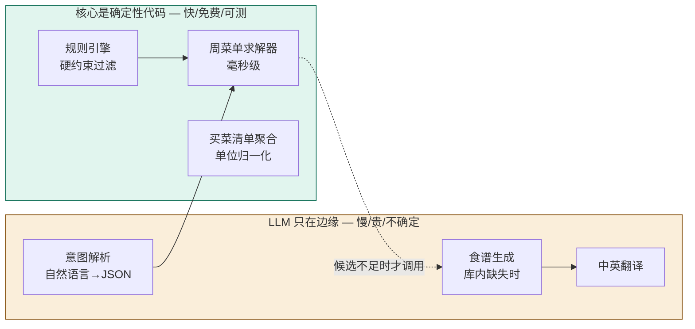
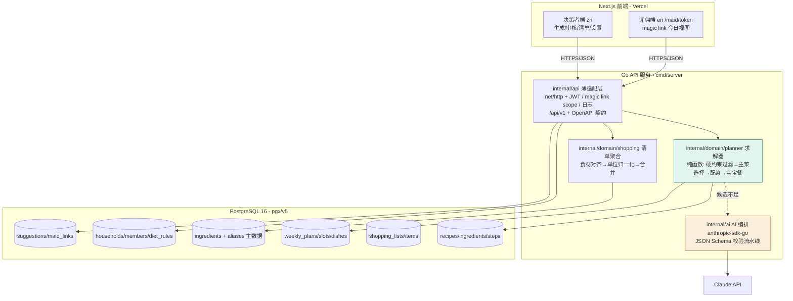
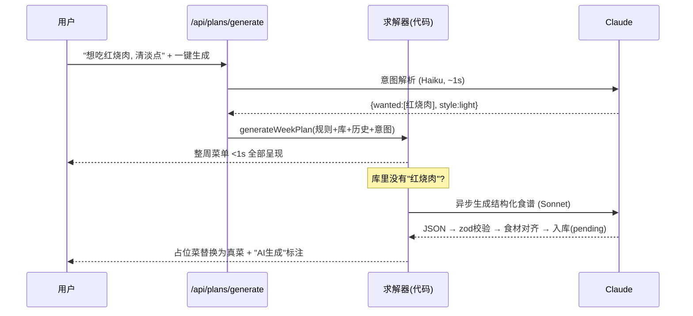
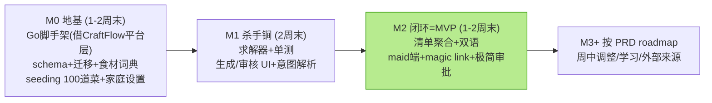

# 膳计 ShanJi —— 技术方案（工程评审 + 可行方案）

> 基于 PRD v0.2.1。本文档分两部分：**Part A 工程评审**（PRD 在工程视角下的问题与修正），**Part B 技术方案**（可直接开工的设计）。

| 项 | 内容 |
|---|---|
| 文档版本 | v0.2（后端改 Go，用户拍板） |
| 日期 | 2026-06-09 |
| 对应 PRD | v0.2.3（docs/PRD.md） |
| 形态 | **Go 后端 + Next.js 前端**（与 CraftFlow 同构，复用用户经验） |
| 工期假设 | 单人副项目 + Claude Code 辅助开发 |

---

# Part A 工程评审

## A1. 总体可行性判定

**可行，且比 PRD 隐含的预期更便宜、更快。** 关键在于一个架构决策：

> **菜单生成不是 AI 问题，是约束满足问题。** 选菜、不重复、菜系配比、蛋白轮换、荤素搭配——全部可以用确定性代码在毫秒级解决。LLM 只应该出现在系统边缘：把自然语言变成结构化意图、库里没有时生成新食谱、做中英翻译。



如果反过来（让 LLM 排菜单），每次生成 = 一次巨型 prompt（全食谱库 + 全规则 + 历史），慢（30s+）、贵、输出不可控、无法写单元测试、换一个菜要重新调一次。**这是本方案最重要的一条工程红线。**

## A2. 评审发现（按严重程度）

### 必须修正（已回写 PRD）

| # | 发现 | 修正 |
|---|---|---|
| E1 | §11 "Planner → AI" 职责边界模糊，存在"LLM 排菜单"的误读空间 | 明确：求解器 = 代码；LLM 仅做意图解析/食谱生成/翻译（见 A1 图） |
| E2 | §12 "分天流式、前 2 天 <10s" 定保守了，且把慢的原因归错了地方 | 改为：**库内选菜即时填满整周（<1s）**；仅当想法命中库外、需要 AI 现编食谱时，该道菜异步生成并占位提示 |

### 设计阶段必须补的隐藏复杂度（PRD 低估的部分）

| # | 发现 | 工程含义 |
|---|---|---|
| E3 | **食材规范化是整个系统真正的脏活**。"西红柿"="番茄"、"小葱"≈"香葱"；过敏匹配（"虾过敏"要挡住"虾仁/虾皮/河虾"）必须在规范化食材上做，否则硬约束是漏的 | 需要 `ingredients` 主数据表 + 别名表；食谱的食材必须外键到主数据，**不允许自由文本**。AI 生成的食谱要先过"食材对齐"校验才能入库 |
| E4 | `DIET_RULE.value` 是 string，过敏规则无法可靠匹配 | 改为关联 `ingredient_id` 或食材 tag；"忌辣"类口味规则用 recipe tag 匹配 |
| E5 | AI 生成食谱的结构化与校验：没有 schema 约束的 LLM 输出不能直接入库 | 用 JSON Schema（zod）强制结构 + 校验流水线（食材对齐、步骤数 3–12、份量数值合理性）+ 失败重试 ≤2 次 + 标注 `source=ai` |
| E6 | 复用餐缺数据结构：`is_reuse` 布尔不够，需要知道复用自哪道菜 | `meal_dishes.reuse_of_dish_id` 自引用外键；买菜清单聚合时复用餐不重复计料（乘 2 在源头那餐） |
| E7 | 周中调整（P1）会让 `WEEKLY_PLAN ||--|| SHOPPING_LIST` 变成 1:N | shopping_lists 加 `version`；MVP 单版本，字段先留好 |
| E8 | magic link 安全：免登录链接 = URL 里的 bearer token | token 哈希存库、scope 限定（只读今日视图 + 提交建议）、可撤销、不含家庭其他数据的接口权限 |
| E9 | "营养均衡分布"无算法定义 | MVP 落地为两条可代码化规则：①主蛋白轮换（猪/鸡/鱼/牛/虾/豆制品，相邻两天不同）②每餐至少 1 份蔬菜类。不做卡路里（与 PRD 一致） |
| E10 | 食谱库冷启动不应手工录入 | 写一次性 **seeding pipeline**：LLM 按 schema 批量生成 → 校验 → 人工抽检 CSV → 导入。1 个周末搞定 100 道 |

### 建议（不阻塞）

- E11 不重复窗口：PRD 只约束"一周内"，但用户体感上"上周刚吃过"也算重复。求解器加**近 14 天 recency 降权**（软偏好，不是硬约束），成本为零。
- E12 部署：前端 → Vercel（免费）；Go API → Fly.io/Railway（免费/低价档）；DB → Neon。或整套 docker compose 自托管（与 CraftFlow 习惯一致），二选一不影响代码结构。
- E13 校验集中在 Go 一处：API 入参校验与 LLM 输出校验**共用同一组 struct + JSON Schema**；前端 TS 类型与之对齐（手写即可，规模小；后续可选 OpenAPI 生成），避免漂移。

---

# Part B 技术方案

## B1. 技术栈（v0.2：后端 Go，用户拍板）

| 层 | 选型 | 理由 |
|---|---|---|
| 后端 | **Go 1.26 + stdlib net/http**（pgx/v5 直查、golang-migrate、zap、viper） | 用户熟悉 Go；复用 CraftFlow 已验证的**代码模式**（中间件、JWT、响应封装、迁移流程），但**不照搬其 ERP 架构**——分层按 B1.5 的 API-first 设计 |
| 前端 | Next.js 15 App Router + TypeScript + Tailwind + shadcn/ui | 移动端优先；纯前端，所有数据走 Go API |
| 数据库 | PostgreSQL 16（dev: docker compose；prod: Neon 或自托管） | PRD 拍板 |
| AI | Claude API **官方 Go SDK（anthropic-sdk-go）**，tool use 强制 JSON 输出 | 意图解析+食谱生成+翻译；模型分级见 B5 |
| 校验 | Go struct + 业务校验层；LLM 输出按 JSON Schema 校验（与 API 入参共用定义） | E13 |
| i18n | 前端 next-intl（zh 默认，/maid 路由强制 en）；菜谱双语字段存库 | 菲佣端整页英文 |
| 认证 | JWT（CraftFlow auth 模式的单家庭简化版）+ maid magic link | 复用已验证的代码模式 |
| 部署 | web→Vercel；Go API→Fly.io/Railway 或 docker compose 自托管；DB→Neon | E12；月成本 ≈ 0–5 USD + Claude API 几美元 |

## B1.5 仓库结构与分层（v0.2.1：为多客户端设计，iOS 是明确的未来目标）

> **不照搬 CraftFlow 架构。** CraftFlow 的模块注册表/事件总线/app-store 式多模块是为"6 个业务域的 ERP"设计的；膳计是单一业务域的小应用，套那层抽象是负资产。从 CraftFlow 复用的只有两类东西：**Go 工程惯例**（cmd/internal/migrations 布局、docker compose、Makefile）和**已验证的代码模式**（中间件、JWT、JSON 响应封装、迁移流程）。

膳计的真实架构需求是另一个：**今天 Web、明天 iOS——后端必须客户端无关**。因此采用 API-first + 轻量整洁分层：

```
shanji/
├── cmd/server/main.go        # 组装: config→db→routes, 单二进制
├── api/openapi.yaml          # ★ API 契约 (contract-first, /api/v1)
│                             #   → 生成 TS 客户端(web) 和 Swift 客户端(iOS)
├── internal/
│   ├── domain/               # ★ 纯领域层: 零 HTTP/零 SQL/零 SDK 依赖
│   │   ├── planner/          #   求解器(纯函数) — 最有价值的代码住这里
│   │   ├── rules/            #   硬约束/软偏好引擎
│   │   └── shopping/         #   清单聚合/单位归一化
│   ├── api/                  # HTTP 适配层: handler/middleware/DTO 映射 (薄)
│   ├── store/                # 存储适配层: pgx repositories
│   ├── ai/                   # 外部服务适配层: anthropic-sdk-go + 校验
│   └── config/
├── migrations/
├── web/                      # Next.js — 只是"第一个客户端"
└── (future) ios/             # Swift — 同一份 openapi.yaml 生成客户端
```

**三条分层纪律（这是 iOS 可移植性的真正保障）：**
1. **业务逻辑只住 `domain/`**，不依赖 HTTP/SQL/SDK——求解器测试不需要起数据库；将来即使换传输层（如 gRPC）或加客户端，领域代码一行不动。
2. **Web 前端零业务逻辑**：Next.js 只做展示与交互，所有规则、求解、聚合都在 Go API 后面。这条守住了，iOS 版就是"再写一个 UI"，而不是"再写一遍业务"。
3. **API 契约先行**（`/api/v1` 版本化 + OpenAPI）：web 和未来 iOS 消费同一份契约；客户端代码生成，杜绝两端模型漂移。

**刻意不做的**（flexible ≠ 提前抽象）：不拆微服务、不上 gRPC、不做插件化模块系统——单二进制 + 无状态 API + Postgres，水平扩展能力已经够到"多家庭 SaaS"那一档（schema 全部带 household_id，天然多租户）。移动端真正需要后端提前留的口子只有三个：**JWT 过期/刷新语义**（magic link 同样适用 App 内 WebView 或原生）、**推送通知抽象**（P1 的提醒功能做成 notifier 接口，Web 用 PWA push、iOS 换 APNs 实现）、**图片走对象存储+CDN URL**（不耦合 web 域名）。

## B2. 总体架构



## B3. 数据库 Schema（DDL 级）

```sql
-- 家庭与规则
households(
  id, name,
  primary_cuisine text, secondary_cuisine text, cuisine_ratio int DEFAULT 60,
  meal_template jsonb,          -- {"lunch":{"main":1,"side":1,"soup":"optional"},...}
  serving_factor numeric DEFAULT 3.3   -- 3 成人 + 2岁 0.3
)
members(id, household_id FK, name, age int, role text)  -- decider/spouse/child/helper

-- 食材主数据（E3：系统的地基）
ingredients(id, canonical_name text UNIQUE, name_en, category text, default_unit text)
ingredient_aliases(id, ingredient_id FK, alias text)     -- 西红柿→番茄

diet_rules(
  id, household_id FK, member_id FK NULL,    -- NULL = 全家
  type text,        -- allergy / forbidden / baby / health / taste
  severity text,    -- hard / soft
  ingredient_id FK NULL,   -- E4：过敏/忌口必须挂食材主数据
  tag text NULL             -- 口味类规则挂 recipe tag，如 spicy
)

-- 食谱
recipes(
  id, name, name_en, cuisine text, course text,   -- main/side/soup/breakfast
  source text,            -- library / ai / external
  status text,            -- active / pending_review（AI 生成先入待审）
  minutes int, difficulty text,
  protein_type text,      -- pork/chicken/fish/beef/shrimp/tofu/none（E9 轮换用）
  nutrition_tags jsonb,   -- ["leafy_veg","high_protein"]
  baby_adaptable bool DEFAULT false
)
recipe_ingredients(id, recipe_id FK, ingredient_id FK, qty numeric NULL, unit text, note text)
  -- qty NULL = “适量”，不参与清单合并（E3/R6）
recipe_steps(id, recipe_id FK, step_order int, text_cn, text_en,
             image_url NULL, baby_split_point bool DEFAULT false)

-- 周计划
weekly_plans(id, household_id FK, week_start date, status text)  -- draft/confirmed
meal_slots(id, plan_id FK, day date, meal_type text, locked bool DEFAULT false)
meal_dishes(
  id, slot_id FK, recipe_id FK,
  target text,            -- adult / baby
  course text,            -- main / side / soup
  reuse_of_dish_id FK NULL  -- E6：复用餐指向源菜，清单聚合跳过
)

-- 买菜清单
shopping_lists(id, plan_id FK, version int DEFAULT 1)            -- E7
shopping_items(id, list_id FK, ingredient_id FK, name, name_en,
               total_qty numeric NULL, unit text, category text, checked bool)

-- 协作与访问
suggestions(id, household_id FK, from_role text, title, content text,
            status text)   -- pending/approved/rejected
maid_links(id, household_id FK, token_hash text, scopes text[],
           created_at, revoked_at NULL)                          -- E8
```

## B4. 周菜单求解器（核心算法，纯函数）

```
generateWeekPlan(household, rules, recipes, history, intent?):
  pool = recipes.filter(hardConstraints)          # 过敏/忌口按 ingredient_id 匹配
  for day in week:
    for meal in template(day):                    # 早/午/晚
      if meal == breakfast: 从早餐小集合轮换；continue
      # —— 主菜（荤）——
      candidates = pool.mains
        .exclude(本周已用主菜, 除非 reuse)
        .score(
          + cuisineWeight        # 主菜系 +w1，次菜系 +w2（占比闸门见下）
          + intentBoost          # 命中用户想法的菜大幅加权
          + proteinRotation      # 与昨日主蛋白不同 +w3（E9）
          - recencyPenalty       # 近14天吃过 -w4（E11）
        )
      # 菜系占比闸门：若本周主菜系占比已 < cuisine_ratio，本次强制取主菜系候选
      main = weightedPick(candidates)
      # —— 素菜/汤：允许 ≥2 天间隔的低频重复 ——
      side = pickSide(pool, gapDays=2); soup = template允许时 pickSoup(...)
      # —— 宝宝餐 ——
      baby = main.baby_adaptable ? splitAt(baby_split_point) : pickBabyPool()
  if intent 中有库内无匹配的菜 → 返回占位 slot + 入 AI 生成队列（异步）
  return plan                                      # 全程无 LLM 调用，<100ms
```

**“换一个”** = 对单个 slot 重跑 scoring，排除当前菜。**重排** = 跳过 locked slots 重跑整周。两者都是毫秒级，体验是即时的。

## B5. AI 编排（LLM 的三个出场点）

实现：`internal/ai` 包，使用官方 **anthropic-sdk-go**，所有结构化输出走 **tool use 强制 JSON**，按 JSON Schema 校验（与 API 入参共用 Go struct 定义，E13）。

| 任务 | 模型 | 输入→输出 | 校验 |
|---|---|---|---|
| 意图解析 | Haiku | "想吃红烧肉，这周清淡点" → `{wanted:["红烧肉"], style:"light", cuisine_override:null}` | schema 校验；解析失败 = 当作无意图，不阻塞生成 |
| 食谱生成/改写 | Sonnet | 菜名 + 家庭约束 + **食材主数据词表** → 完整结构化食谱 JSON | schema + 食材对齐（必须命中词表或显式 new_ingredient）+ 步骤 3–12 步 + 份量合理性；失败重试 ≤2；入库 `status=pending_review`、标注 AI 生成 |
| 翻译 | Haiku | 中文食谱 → text_en / name_en 批量 | 长度与字段完整性检查 |



**成本估算**：seeding 100 道菜一次性 ≈ $2–4；日常每周生成 ≈ 3–6 次 Haiku + 0–2 次 Sonnet ≈ **每月 < $2**。可忽略。

## B6. API 设计（Go net/http；全部挂 `/api/v1` 前缀，契约见 api/openapi.yaml）

```
POST /api/auth/login                     # 家庭账号
GET/PUT /api/household                   # 主菜系/占比/餐次模板/份量系数
CRUD /api/members /api/rules
GET  /api/recipes?query=&cuisine=        # 库内搜索
POST /api/recipes/generate               # AI 生成（异步任务）
POST /api/plans/generate                 # {week_start, ideas?} → 整周方案
PATCH /api/plans/:id/slots/:slotId       # swap / lock / delete / assign
POST /api/plans/:id/confirm              # → 生成 shopping_list + 解锁 maid 视图
GET  /api/plans/:id/shopping-list        # 双语清单
PATCH /api/shopping-items/:id            # 勾选
GET  /api/maid/today?token=…             # 免登录，scope 校验（E8）
POST /api/maid/suggestions?token=…
POST /api/suggestions/:id/approve|reject # 极简审批
```

## B7. 前端页面（对应 PRD §8 信息架构）

| 路由 | 说明 |
|---|---|
| `/` | 本周菜单看板（7×3 网格，移动端按天纵向） |
| `/generate` | 想法输入 + 一键生成 + 逐餐审核（换/锁/删） |
| `/recipes` `/recipes/[id]` | 食谱库搜索 + 详情（双语步骤、分餐点标记） |
| `/shopping` | 双语清单、品类分组、勾选、分享导出 |
| `/settings` | 成员、规则、主菜系与占比、餐次模板 |
| `/maid/[token]` | 英文今日视图 + 建议提交（独立布局，无导航泄露） |
| `/inbox` | 建议箱：通过/拒绝 + 一键排期 |

## B8. 测试与质量

- **求解器**：`go test` 纯函数单测——不重复约束、菜系占比闸门、蛋白轮换、过敏过滤、复用餐豁免、锁定重排。这是测试投入的大头，也是最值的（Go 的表驱动测试风格非常适合这类约束矩阵）。
- **AI 输出**：固定 eval 集（10 个想法输入 + 5 个生成菜名），断言 schema 通过率与约束命中；CI 可选跑。
- **清单聚合**：单位归一化表驱动测试（克/斤/个/适量混合场景）。
- **E2E**：Playwright 跑通"生成→审核→确认→清单→maid 链接"一条主链路即可。

## B9. 里程碑与工期（单人 + Claude Code，按周末估）



**MVP 合计约 4–6 个周末。** 最大不确定性在 M0 的食材词典质量（E3）——建议 seeding 时让 LLM 同时产出食材主数据与别名，人工抽检一遍。

## B10. 工程风险

| # | 风险 | 缓解 |
|---|---|---|
| T1 | 食材规范化词典不全 → 过敏过滤漏网 | 食谱食材强制 FK；AI 生成必须对齐词表；过敏规则按食材+其别名匹配；新食材人工确认 |
| T2 | AI 食谱步骤不靠谱 | pending_review 状态 + "AI 生成"标注 + 做过一次后可"转正"入精选 |
| T3 | 求解器候选池太小（库 100 道）导致一周排不满 | seeding 按 course 配比（主菜 60/素菜 25/汤 10/早餐 5）且**每菜系保证最低主菜深度（≥14 道）**——库是全局多菜系内容，家庭主菜系占比由求解器选菜时实现（多租户纪律：偏好住 household，内容库不绑定偏好）；某菜系深度不足时求解器降级到次菜系/家常 + AI 生成补位；素菜汤允许低频重复本身就是泄压阀 |
| T4 | magic link 泄露 | token 哈希存储、scope 最小化、设置页一键撤销重发 |
| T5 | 单人项目烂尾 | M0–M2 严格砍范围；每个里程碑结束都是可用状态 |
